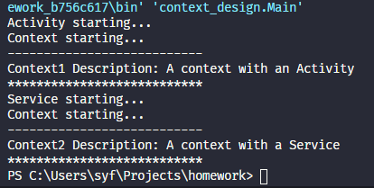

# Context的装饰器模式实现思路

> 佘玉非 SA20225386

`Context`是抽象基类，表示一个应用运行的上下文，在装饰器模式中充当基础组件。

```java
public abstract class Context
{
    public abstract void start();
    public abstract String getDescription();
}
```

`ContextImpl`是具体的Context实现类，提供有基础的上下文功能，在装饰器模式中充当具体组件

```java
public class ContextImpl extends Context {
    @Override
    public void start() {
        System.out.println("Context starting...");
    }

    @Override
    public String getDescription() {
        return "A context";
    }
}
```

`ContextWrapper`是`Context`的包装类，存储`Context`实例，在装饰器模式中充当装饰器通用接口，声明具体装饰器应该实现的功能

```java
public abstract class ContextWrapper extends Context {

    Context mBase;

    public ContextWrapper(Context context)
    {
        mBase = context;
    }

    @Override
    public abstract void start();

    @Override
    public abstract String getDescription();
}
```

`Activity`在`Context`应用上下文的基础上通过组合添加了应用的用户交互等功能，在装饰器模式中充当一个具体装饰器

```java
public class Acitvity extends ContextWrapper {
    public Acitvity(Context context) {
        super(context);
    }

    @Override
    public void start()
    {
        System.out.println("Activity starting...");
        mBase.start();
    }

    @Override
    public String getDescription()
    {
        return mBase.getDescription() + " with an Activity";
    }
}
```

`Service`在`Context`应用上下文的基础上通过组合添加了长时间运行的某种功能，在装饰器模式中充当一个具体装饰器

```java
public class Service extends ContextWrapper {

    public Service(Context context) {
        super(context);
    }

    @Override
    public void start()
    {
        System.out.println("Service starting...");
        mBase.start();
    }
    
    @Override
    public String getDescription()
    {
        return mBase.getDescription() + " with a Service";
    }
}
```

对以上设计的简单测试

```java
public class Main {
    public static void main(String[] args) {
        Context context1 = new ContextImpl();
        context1 = new Acitvity(context1);
        Context context2 = new ContextImpl();
        context2 = new Service(context2);
        testContext(context1, 1);
        testContext(context2, 2);
    }

    public static void testContext(Context context, int i) {
        context.start();
        System.out.println("---------------------------");
        System.out.println("Context" + i + " Description: " + context.getDescription());
        System.out.println("***************************");
    }
}
```

运行结果：


