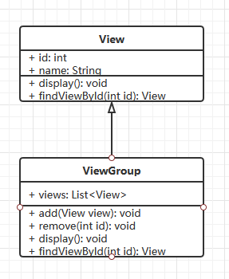

# Android程序设计作业 #2

> 日期：2020-09-29

## `ViewGroup`与`View`伪代码实现

### UML



```java
public class View
{
    int id;
    String name;

    public View(int id, String name)
    {
        this.id = id;
        this.name = name;
    }

    public void display()
    {
        println("Displaying :" + name);
    }

    public View findViewById(int id)
    {
        return this.id == id ? this : null;
    }
}
```

```java
public class ViewGroup extends View
{
    ArrayList<View> views;

    public void add(View view)
    {
        views.add(view);
    }

    public void remove(int id)
    {
        views.removeIf(v -> v.id == id);
    }

    @Override
    public void display()
    {
        for (View view : views)
        {
            view.display();
        }
    }

    @Override
    public View findViewById(int id)
    {
        View result = null;

        for (View view : views)
        {
            View v = view.findViewById(id);
            if (v != null)
            {
                result = v;
                break;
            }
        }

        return result;
    }
}
```

## 分析函数`findViewById`的实现

应用程序的布局整体呈现树形，考虑使用递归实现函数`findViewById`。

函数应该是从`ViewGroup`对象调用，利用多态对`ViewGroup`下的子节点分别调用`findViewById`。

首先，子节点全部为`View`的情况下，函数对子节点遍历，同时比对`id`，查看是否有目标`View`；其次，如果子节点中也有`ViewGroup`，则调用其`findViewById`函数递归处理。
