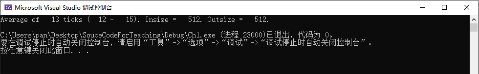
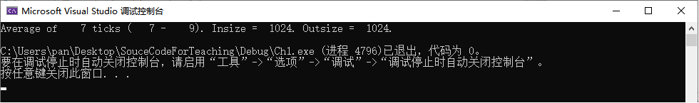
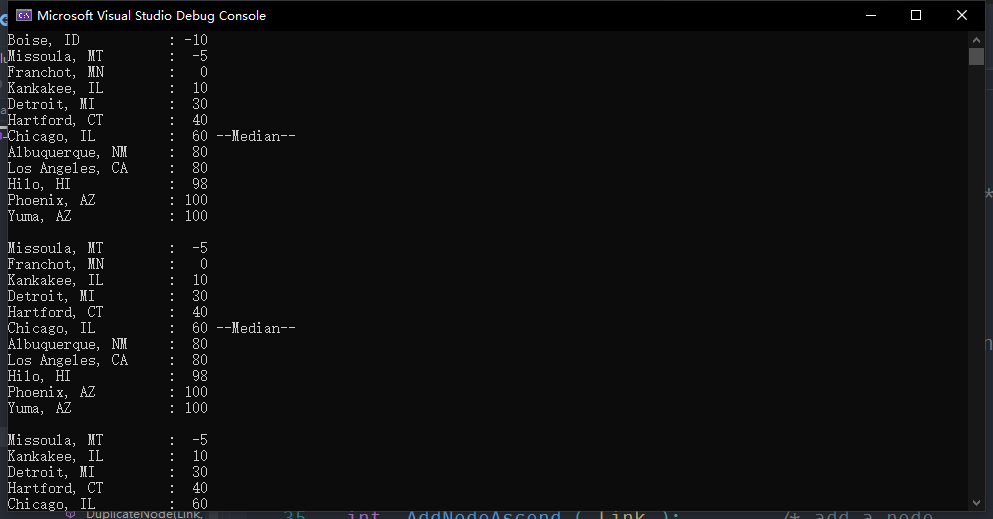
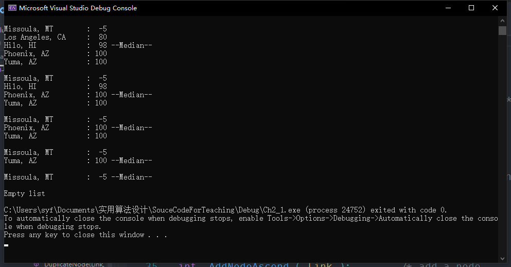
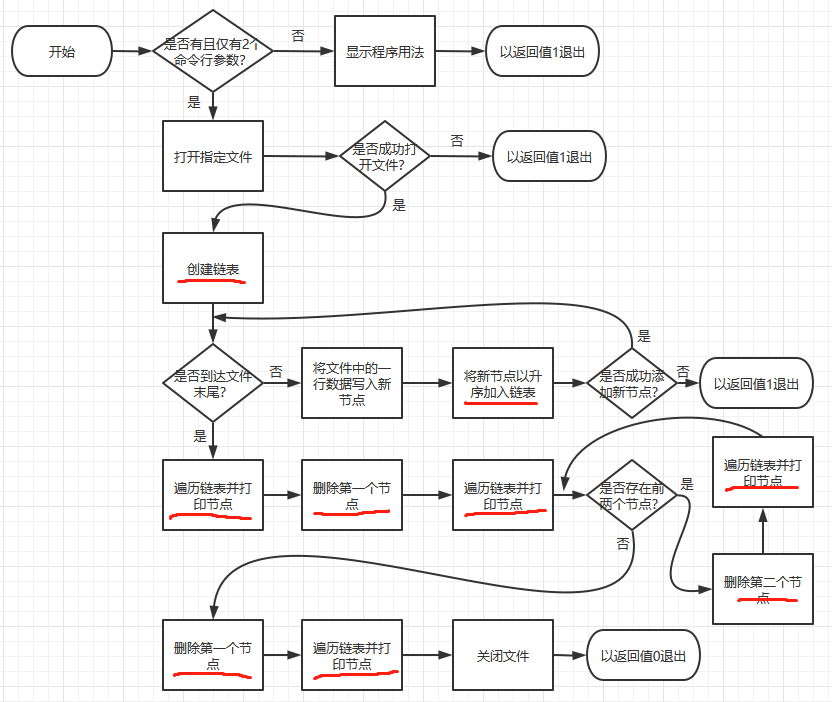

# 实用算法设计 - 课前01

## 分工

> SA20225364 潘志峰：ch1

> SA20225386 佘玉非：ch2-1

## 一、ch1

### 1、运行结果

**512bytes**



**1024bytes**（更优）



### 2、数据结构及函数分析

```c++
// 主函数，程序入口
int main ( int argc, char *argv[] )	
// 逐个字符的读入到输入缓冲区，再逐个字符的输出到输出缓冲区，并返回时间差值
long CopyFile ( char *infilename, char *outfilename, size_t insize, size_t outsize )
// 宏定义
#define get_clock_ticks(x) x = GetCPUTime()
// 获取当前时间
long GetCPUTime()
```

> 传入命令参数argv[]时，使用了数组
>
> 调用函数时，使用了栈

### 3、Main函数中的算法思路


### 4、子函数的实现

* `CopyFile()`

  该函数接受4个参数，`char *infilename`和`char *outfilename`是输入文件和输出文件的名字，在项目属性中提前设置好为`tt.txt`和`tt1.txt`，`insize`和`outsize`输入输出缓冲区的大小默认为512Bytes，可以在参数中设置传入或直接修改`DEF_BUF`。

  * 打开输入文件设置输入缓冲区大小；（失败就程序结束）
  * 打开输出文件设置输出缓冲区大小；（失败就程序结束）
  * 获取开始时间
  * 逐字读入逐字输出
  * 获取结束时间
  * 关闭输入文件和输出文件
  * 返回时间差值
  
* `GetCPUTime()`

  ```c++
  typedef union _LARGE_INTEGER {
      struct {
          ULONG LowPart;
          LONG HighPart;
      };
      struct {
          ULONG LowPart;
          LONG HighPart;
      } u;
      LONGLONG QuadPart;
  } LARGE_INTEGER;
  // 可以方便的获取高32位和低32位，比较运算时使用QuadPart
  ```
  
  调用`QueryPerformanceFrequency()`函数获得机器内部计时器的时钟频率
  
  `QueryPerformanceCounter()`返回高精度计数器的值，精确到微秒；
  

---

## Ch2_1

### 运行项目




### 使用的数据结构和函数

数据结构：

```cpp
/* 存储城市温度数据使用了单链表 */

// 单链表的一个节点
struct Node {
    char  *City;
    int    Temp;
    struct Node *Next;
};

// 用一个指向单链表的指针表示表头
typedef struct Node * Link;

// 存储城市温度数据的单链表
Link Head;
// 单链表的长度
int  NodeCount;
```

```cpp
/* 读文件时用到数组作为缓冲区 */

// 读文件时的缓冲区
char buffer[128];
```

函数

```cpp
// 按照升序添加节点
int  AddNodeAscend ( Link );

// 创建链表
void CreateList ( void );

// 删除一个指定的节点
int  DeleteNode ( Link );

// 处理冗余节点
int  DuplicateNode ( Link, Link );

// 释放一个节点的内存
void FreeNode ( Link );

// 遍历链表，按顺序向命令行打印城市温度数据
void ShowNodes ( void );

// 比较节点，用于实现升序插入节点以及删除指定节点
int  NodeCmp ( Link, Link );
```

### 算法框图



### 子函数的实现思路

```cpp
int AddNodeAscend ( Link to_add )
{
    Link   pn,   /* 用于存放待添加节点的副本 */
           prev, /* 指向前一个节点 */
           curr; /* 指向当前节点 */
    struct Node dummy; // 用哑节点统一操作逻辑
    int    i; // 用于存放比较节点的结果

    /* 手动申请内存，返回对应的指针 */
    pn = ( Link ) malloc ( sizeof ( struct Node ));
    if ( pn == NULL )
        return 0;
    // 向申请到的内存拷贝待添加的节点数据
    memcpy ( pn, to_add, sizeof ( struct Node ));

    // 初始化本地变量
    dummy.Next = Head;
    prev = &dummy;
    curr = Head;

    /* 添加节点pn */
    for ( ;; prev = curr, curr = curr->Next )
    {
        if ( curr == NULL )
            break; /* 到达链表末尾后跳出循环 */

        i = NodeCmp ( pn, curr ); // 比较节点，寻找合适的插入位置
        if ( i <= 0 )
             break; // 找到第一个大于pn的节点，pn插入在curr之前，跳出循环
    }

    if ( curr && i == 0 ) /* 冗余节点 */
        if ( DuplicateNode ( curr, pn ) == 0 )
            return ( 1 ); /* 此节点冗余，结束程序 */

    // 将pn插入到prev和curr之间
    prev->Next = pn;
    pn->Next = curr;

    // 维护全局变量Head和NodeCount
    Head = dummy.Next;
	NodeCount+=1;
    return ( 1 );
}

/** 对于冗余节点，或许会有不同的处理方式，此处提取出一个函数方便后续修改
 * 当前的处理方式为直接释放冗余节点
 */
int DuplicateNode ( Link inlist, Link duplicate )
{
    
    FreeNode ( duplicate );
    return ( 0 );
}

// 删除指定节点
int DeleteNode ( Link to_delete )
{
    Link curr,  /* the current node */
         prev;  /* the previous node */
    int  i; // 保存比较节点的结果

    // 链表为空时无法删除节点，直接返回
    if ( Head == NULL )
        return ( 0 );

    // 遍历所有节点，寻找链表中与待删除节点相等的节点
    // 由于链表是升序排列的，所以在to_delete大于curr的情况下，
    // 应该持续摸链，匹配的节点只可能存在于curr之后
    for ( prev = NULL, curr = Head;
        curr != NULL && ( i = NodeCmp ( to_delete, curr )) > 0;
        prev = curr, curr = curr->Next )
        /* loop around */ ;

    // 检查第一个大于等于to_delete的curr
    if ( curr != NULL && i == 0 )
    {
        if ( prev )
            prev->Next = curr->Next;
        else              /* deleting Head */
            Head = curr->Next;

        FreeNode ( curr );
        NodeCount -= 1;
        return ( 1 );
    }

    // else的情况下，curr > to_delete
    // 而且curr之后所有的节点都大于to_delete
    // 因此不可能再有匹配的节点

    return ( 0 );
}

// 比较节点
int NodeCmp ( Link a, Link b )
{
    // 温度不同的情况下，根据温度大小判断节点大小
    if ( a->Temp != b->Temp )
        return ( a->Temp - b->Temp );

    // 温度相同的情况下，根据城市字符串判断节点大小
    // 若温度和城市字符串都相等，则两节点相等
    return strcmp ( a->City, b->City );
}


// 创建链表
void CreateList ( void )
{
    // 初始化相应的全局变量
    Head = NULL;
    NodeCount = 0;
}

// 释放节点对应的内存
void FreeNode ( Link n )
{
    // 要先释放节点所拥有的资源
    // 否则这些资源无法被索引到，将常驻内存
    free ( n->City );
    free ( n );
}

// 遍历链表并打印城市温度数据，包括显示中位数
void ShowNodes( void )
{
    Link pn;
    int count, median;

 //   /* count the nodes */
 //   for ( count = 0, pn = Head; pn; pn = pn->Next )
 //       count += 1;

 //   /* compute the median node */
 //   median = count / 2 + 1;

	// 计算中位数的位置
	median = NodeCount/2+1;//yyw

    if ( NodeCount ) /* only print if there's a node */
    {
        // 链表不空的情况下，遍历所有节点，按照一定的格式打印输出

        /* initialize the needed variables */
        count = 0;     /* count of nodes we've printed */
        for ( pn = Head; pn; pn = pn->Next )
        {
            printf ( "%-20s: %3d", pn->City, pn->Temp );
            count += 1;
            if ( count == median )
                printf ( " --Median--" );
            printf ( "\n" );
        }
    }
    else
        printf ( "Empty list\n" );
}
```
